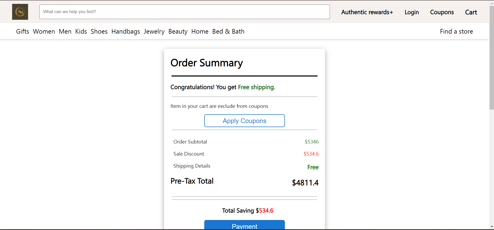

# -true-mine-3269
Deployed-link https://effortless-figolla-edac29.netlify.app/index.html

UI: 


Markup:
- elements, classes & IDs should be identical to the below screenshot.
- The data should be fetched , make a 'GET' request at ```${baseServerURL}/employees```
- The employees should be shown on page ```load```


### Problem 2. Ability to add new Employee [3]


- make a 'POST' request at ```${baseServerURL}/employees```
the page must not reload
the list must update

### Problem 3. Ability to update all the fields of an employee [2]

- Able to populate following input on edit link click.
- add a event listener with ```click``` to anchor tag with class `.card-link` use preventDefault.
- The page should not re-load on the click of the Edit link `.card-link`.

1. To updated all fields 

- `#update-employee-id`  should be populated with the `id` of the employee 
- `#update-employee-name` should be populated with the `name` of the employee
- `#update-employee-image` should be populated with the `image URL` of the employee
- `#update-employee-dept` should be populated with the `department` of the employee
- `#update-employee-salary` should be populated with the `salary` of the employee



- make a 'PATCH' request at ```${baseServerURL}/employees/${empId}``` to updated name , image ,dept and salary
- page must not reload
- the list must update

### Problem 4. Ability to update only the salary [2]

- Able to populate following input on edit link click.
- `#update-score-employee-id` should be populated with the `id` of the employee
- `#update-score-employee-salary` should be populated with the `price` of the employee

- Once the edit inputs are populated, if the user clicks `#update-score-employee`. 
- the salary of that particular employee should update based on the value entered in the `#update-score-employee-salary`. 
- The salary of the employee in the list should update without any page reloads.

- make a 'PATCH' request at ```${baseServerURL}/employees/${empId}```

### Problem 5. Ability to sort data by salary [2]


- On click of the button ```#sort-low-to-high```, the employee list should be sorted in ascending order based on their salary. 
- On click of the button ```#sort-high-to-low```, the employee list should be sorted in descending order based on their salary.
- You may use any approach of your choice for sorting. You may sort the available data or you may make a new fetch request to the server and update the list. In case you want to fetch data, please use the [JSON Server documentation](https://github.com/typicode/json-server).
- page must not reload
- the list must update

### Problem 6. Ability to filter data by salary [2]


- When the button `#filter-less-than-1L` is clicked, the employee list is expected to be filtered. It should only show the employees whose `salary` is less than 1Lakh.
- When the button `#filter-more-than-equal-1L` is clicked, the employee list is expected to be filtered. It should only show the employees whose `salary` is more than or equal to 1Lakh.
- You may use any approach of your choice for sorting. You may sort the available data or you may make a new fetch request to the server and update the list. In case you want to fetch data, please use the [JSON Server documentation](https://github.com/typicode/json-server).
- page must not reload
- the list must update
### General guidelines
- The system on cp.masaischool.com may take between 1-20 minutes for responding,
- so we request you to read the problem carefully and debug it before itself
- we also request you not just submit it last minute
- try to keep one submission at a time
- Use `${baseServerURL}/what-ever-route` for server url & not `localhost:9090/what-ever-route` in your solution. Failing to do so may cause all the tests to fail.
- If you try to use VSCodes live server, it won’t work. Use the npm commands provided in this file only.
